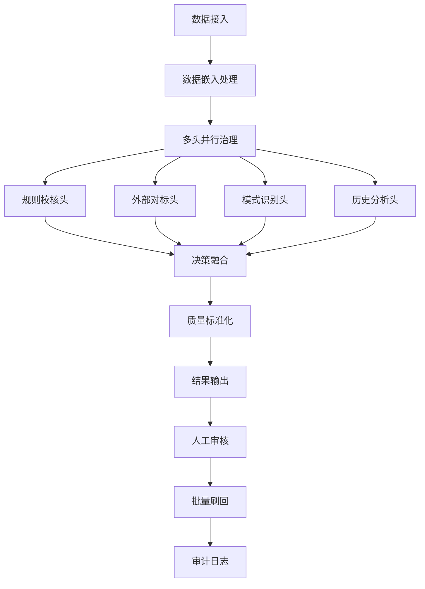

# Transformer架构优化的数据治理系统

## 项目概述

基于Gemini专家建议，将Transformer架构的核心思想深度应用于国网营销档案数据治理，构建一个具备多维度分析、智能决策和高鲁棒性的"数据理解与生成"系统。

---

## 一、架构设计理念

### 1.1 Transformer映射思想

将数据治理系统设计为一个宏观的**"数据治理Transformer"**，核心组件映射如下：

- **Input Embedding** → **数据接入与标准化**
- **Multi-Head Attention** → **多维度并行治理**
- **Feed-Forward Network** → **治理结果融合与决策**
- **Residual Connection** → **治理过程可追溯性**
- **Layer Normalization** → **数据质量标准化**
- **Positional Encoding** → **时空上下文感知**

### 1.2 核心优化原则

1. **并行处理**：多个治理头同时工作，提升效率
2. **信息丰富**：多维度分析，提供全面的治理建议
3. **智能决策**：自动融合多源信息，生成最优方案
4. **可追溯性**：完整保留治理过程和原始数据
5. **标准统一**：确保全省治理标准一致性

---

## 二、系统架构设计

### 2.1 数据接入与标准化层（Input Embedding）

#### 功能职责
- 从Oracle/PostgreSQL读取原始档案数据
- 数据格式标准化和清洗
- 生成数据上下文嵌入向量

#### 核心组件

**DataEmbeddingProcessor（数据嵌入处理器）**
```python
class DataEmbeddingProcessor:
    def __init__(self):
        self.standardizer = DataStandardizer()
        self.context_encoder = ContextEncoder()
    
    def process_record(self, raw_record):
        # 1. 数据标准化
        standardized_data = self.standardizer.normalize(
            address=raw_record['address'],
            phone=raw_record['phone'],
            id_card=raw_record['id_card']
        )
        
        # 2. 上下文嵌入
        context_vector = self.context_encoder.encode({
            'data_source': raw_record['source'],
            'create_time': raw_record['create_time'],
            'last_update': raw_record['last_update'],
            'region_code': raw_record['region_code'],
            'customer_level': raw_record['customer_level'],
            'historical_changes': raw_record['change_history']
        })
        
        return {
            'record_id': raw_record['id'],
            'standardized_data': standardized_data,
            'context_vector': context_vector,
            'metadata': raw_record['metadata']
        }
```

**数据标准化规则**
- 地址：全角转半角，统一"号"和"室"，去除特殊字符
- 手机号：格式验证，区号处理，运营商识别
- 身份证：格式校验，地区码验证，校验位计算

### 2.2 多头注意力治理层（Multi-Head Attention）

#### 设计思想
从不同"视角"并行关注数据的不同方面，实现真正的多维度治理。

#### 四个治理头设计

**治理头1：规则校核Agent（Rule-Based Head）**
```python
class RuleBasedGovernanceHead:
    def __init__(self):
        self.rule_engine = RAGEnhancedRuleEngine()
        self.business_rules = BusinessRuleRepository()
    
    def process(self, data_embedding):
        results = []
        for field, value in data_embedding['standardized_data'].items():
            rule_result = self.rule_engine.validate(
                field=field,
                value=value,
                context=data_embedding['context_vector']
            )
            results.append({
                'field': field,
                'pass': rule_result['valid'],
                'reason': rule_result['reason'],
                'suggestion': rule_result['suggestion'],
                'confidence': rule_result['confidence']
            })
        return {
            'head_type': 'rule_based',
            'results': results,
            'overall_score': self._calculate_score(results)
        }
```

**治理头2：外部数据对标Agent（Cross-Reference Head）**
```python
class CrossReferenceGovernanceHead:
    def __init__(self):
        self.sf_api = ShunfengAddressAPI()
        self.telecom_api = TelecomValidationAPI()
        self.id_verification_api = IDVerificationAPI()
    
    def process(self, data_embedding):
        results = []
        data = data_embedding['standardized_data']
        
        # 地址验证
        if 'address' in data:
            sf_result = self.sf_api.validate_address(data['address'])
            results.append({
                'field': 'address',
                'match_found': sf_result['found'],
                'standard_value': sf_result['standard_address'],
                'confidence': sf_result['confidence'],
                'source': 'shunfeng'
            })
        
        # 手机号验证
        if 'phone' in data:
            telecom_result = self.telecom_api.validate_phone(data['phone'])
            results.append({
                'field': 'phone',
                'valid': telecom_result['valid'],
                'carrier': telecom_result['carrier'],
                'region': telecom_result['region'],
                'confidence': telecom_result['confidence'],
                'source': 'telecom'
            })
        
        return {
            'head_type': 'cross_reference',
            'results': results,
            'overall_confidence': self._calculate_confidence(results)
        }
```

**治理头3：模式识别Agent（Pattern Recognition Head）**
```python
class PatternRecognitionGovernanceHead:
    def __init__(self):
        self.anomaly_detector = AnomalyDetectionModel()
        self.pattern_analyzer = PatternAnalyzer()
        self.ml_models = MLModelRepository()
    
    def process(self, data_embedding):
        results = []
        data = data_embedding['standardized_data']
        context = data_embedding['context_vector']
        
        # 异常模式检测
        anomaly_score = self.anomaly_detector.detect(
            data=data,
            context=context,
            regional_patterns=self._get_regional_patterns(context['region_code'])
        )
        
        # 统计模式分析
        pattern_analysis = self.pattern_analyzer.analyze(
            data=data,
            historical_data=self._get_historical_data(data_embedding['record_id'])
        )
        
        results.append({
            'anomaly_detected': anomaly_score > 0.7,
            'anomaly_score': anomaly_score,
            'anomaly_type': self._classify_anomaly(anomaly_score, data),
            'pattern_insights': pattern_analysis,
            'risk_indicators': self._extract_risk_indicators(data, context)
        })
        
        return {
            'head_type': 'pattern_recognition',
            'results': results,
            'risk_score': anomaly_score
        }
```

**治理头4：历史沿革分析Agent（Historical Analysis Head）**
```python
class HistoricalAnalysisGovernanceHead:
    def __init__(self):
        self.history_analyzer = HistoryAnalyzer()
        self.change_pattern_detector = ChangePatternDetector()
    
    def process(self, data_embedding):
        record_id = data_embedding['record_id']
        current_data = data_embedding['standardized_data']
        
        # 获取历史变更记录
        change_history = self._get_change_history(record_id)
        
        # 分析变更模式
        change_analysis = self.change_pattern_detector.analyze(
            history=change_history,
            current_data=current_data
        )
        
        # 计算风险评分
        risk_score = self._calculate_historical_risk(
            change_frequency=change_analysis['frequency'],
            change_pattern=change_analysis['pattern'],
            time_intervals=change_analysis['intervals']
        )
        
        return {
            'head_type': 'historical_analysis',
            'change_frequency': change_analysis['frequency'],
            'last_change_days': change_analysis['days_since_last_change'],
            'change_pattern': change_analysis['pattern'],
            'stability_score': change_analysis['stability'],
            'risk_score': risk_score,
            'recommendations': self._generate_recommendations(change_analysis)
        }
```

### 2.3 决策融合层（Feed-Forward Network）

#### 决策Agent设计
```python
class DecisionFusionAgent:
    def __init__(self):
        self.decision_model = DecisionFusionModel()
        self.confidence_calculator = ConfidenceCalculator()
        self.action_recommender = ActionRecommender()
    
    def fuse_results(self, multi_head_results):
        # 1. 扩展阶段：汇集所有头的输出
        all_evidence = self._collect_evidence(multi_head_results)
        
        # 2. 激活/筛选阶段：应用决策模型
        decision_context = {
            'rule_results': multi_head_results['rule_based'],
            'external_validation': multi_head_results['cross_reference'],
            'pattern_analysis': multi_head_results['pattern_recognition'],
            'historical_analysis': multi_head_results['historical_analysis']
        }
        
        # 智能决策逻辑
        final_decision = self._make_decision(decision_context)
        
        # 3. 压缩/总结阶段：生成标准化输出
        governance_result = {
            'record_id': multi_head_results['record_id'],
            'field_results': self._process_field_results(final_decision),
            'overall_status': final_decision['status'],
            'confidence_score': self.confidence_calculator.calculate(all_evidence),
            'risk_level': self._assess_risk_level(final_decision),
            'evidence_summary': self._summarize_evidence(all_evidence),
            'recommended_action': self.action_recommender.recommend(final_decision),
            'processing_timestamp': datetime.now()
        }
        
        return governance_result
    
    def _make_decision(self, context):
        # 决策逻辑示例
        rule_pass_rate = self._calculate_rule_pass_rate(context['rule_results'])
        external_confidence = context['external_validation']['overall_confidence']
        pattern_risk = context['pattern_analysis']['risk_score']
        historical_risk = context['historical_analysis']['risk_score']
        
        # 综合评分
        if (rule_pass_rate > 0.9 and external_confidence > 0.9 and 
            pattern_risk < 0.3 and historical_risk < 0.3):
            return {'status': 'auto_approve', 'confidence': 0.95}
        elif (rule_pass_rate < 0.5 or pattern_risk > 0.8 or historical_risk > 0.8):
            return {'status': 'manual_review', 'confidence': 0.85}
        else:
            return {'status': 'suggestion_generated', 'confidence': 0.75}
```

### 2.4 残差连接与可追溯性（Residual Connection）

#### 数据库设计
```sql
-- 治理记录表
CREATE TABLE governance_records (
    id UUID PRIMARY KEY,
    record_id VARCHAR(50) NOT NULL,
    field_name VARCHAR(50) NOT NULL,
    original_value TEXT,
    suggested_value TEXT,
    governance_status VARCHAR(20), -- 'pending', 'approved', 'rejected', 'completed'
    risk_level VARCHAR(10), -- 'low', 'medium', 'high'
    confidence_score DECIMAL(3,2),
    evidence_details JSONB, -- 存储所有治理头的详细结果
    decision_reasoning TEXT,
    operator_id VARCHAR(50),
    created_at TIMESTAMP DEFAULT NOW(),
    updated_at TIMESTAMP DEFAULT NOW(),
    completed_at TIMESTAMP
);

-- 治理证据表
CREATE TABLE governance_evidence (
    id UUID PRIMARY KEY,
    governance_record_id UUID REFERENCES governance_records(id),
    evidence_source VARCHAR(50), -- 'rule_based', 'cross_reference', 'pattern_recognition', 'historical_analysis'
    evidence_type VARCHAR(50),
    evidence_content JSONB,
    confidence_score DECIMAL(3,2),
    created_at TIMESTAMP DEFAULT NOW()
);

-- 治理审计日志表
CREATE TABLE governance_audit_log (
    id UUID PRIMARY KEY,
    governance_record_id UUID REFERENCES governance_records(id),
    action_type VARCHAR(50), -- 'created', 'approved', 'rejected', 'completed', 'rolled_back'
    operator_id VARCHAR(50),
    operator_role VARCHAR(50),
    action_details JSONB,
    timestamp TIMESTAMP DEFAULT NOW()
);
```

### 2.5 层归一化与质量标准化（Layer Normalization）

#### 质量标准化组件
```python
class QualityNormalizationLayer:
    def __init__(self):
        self.quality_metrics = QualityMetricsCalculator()
        self.normalization_rules = NormalizationRuleEngine()
    
    def normalize_governance_result(self, governance_result):
        # 1. 计算质量指标
        quality_metrics = self.quality_metrics.calculate(
            governance_result=governance_result,
            historical_performance=self._get_historical_performance()
        )
        
        # 2. 应用标准化规则
        normalized_result = self.normalization_rules.apply(
            result=governance_result,
            quality_metrics=quality_metrics,
            regional_standards=self._get_regional_standards()
        )
        
        # 3. 质量评分标准化
        normalized_result['quality_score'] = self._normalize_quality_score(
            raw_score=governance_result['confidence_score'],
            quality_metrics=quality_metrics
        )
        
        return normalized_result
```

---

## 三、系统实现架构

### 3.1 技术栈选择

**后端架构：**
- **框架**：FastAPI + Celery（异步任务处理）
- **数据库**：PostgreSQL（主库）+ Redis（缓存）
- **消息队列**：RabbitMQ
- **AI模型**：Transformers + scikit-learn
- **外部API**：顺丰地址API、运营商验证API

**前端架构：**
- **框架**：Vue.js 3 + Element Plus
- **可视化**：ECharts + D3.js
- **状态管理**：Pinia

**部署架构：**
- **容器化**：Docker + Kubernetes
- **监控**：Prometheus + Grafana
- **日志**：ELK Stack

### 3.2 系统流程设计

#### 数据治理流程


### 3.3 性能优化策略

**并行处理优化：**
- 多头治理并行执行，减少处理时间
- 异步任务队列，提升系统吞吐量
- 数据分区处理，避免大表查询

**缓存策略：**
- Redis缓存常用规则和外部API结果
- 本地缓存治理模型和决策规则
- 分布式缓存共享治理经验

**数据库优化：**
- 分区表设计，按地区和时间分区
- 索引优化，提升查询性能
- 读写分离，减少主库压力

---

## 四、关键技术创新点

### 4.1 多头注意力机制创新
- **视角多样性**：从规则、外部验证、模式识别、历史分析四个维度并行分析
- **信息融合**：智能决策Agent综合多维度信息，生成最优治理方案
- **动态权重**：根据数据特征和历史表现动态调整各头权重

### 4.2 上下文感知能力
- **时空上下文**：结合数据创建时间、地理位置、业务场景
- **历史上下文**：分析数据变更历史，识别异常模式
- **业务上下文**：考虑客户等级、业务重要性等因素

### 4.3 可解释性设计
- **证据链追踪**：完整记录每个治理决策的证据来源
- **决策推理**：提供清晰的决策逻辑和推理过程
- **可视化展示**：直观展示治理过程和结果

### 4.4 自适应学习能力
- **在线学习**：根据人工反馈持续优化治理策略
- **模式更新**：定期更新异常检测模型和规则库
- **经验积累**：积累治理经验，提升决策准确性

---

## 五、部署与运维

### 5.1 部署架构
```yaml
# Kubernetes部署配置示例
apiVersion: apps/v1
kind: Deployment
metadata:
  name: governance-system
spec:
  replicas: 3
  selector:
    matchLabels:
      app: governance-system
  template:
    metadata:
      labels:
        app: governance-system
    spec:
      containers:
      - name: governance-api
        image: governance-system:latest
        ports:
        - containerPort: 8000
        env:
        - name: DATABASE_URL
          valueFrom:
            secretKeyRef:
              name: db-secret
              key: url
        resources:
          requests:
            memory: "512Mi"
            cpu: "500m"
          limits:
            memory: "1Gi"
            cpu: "1000m"
```

### 5.2 监控指标
- **系统性能**：响应时间、吞吐量、错误率
- **治理质量**：准确率、召回率、F1分数
- **业务指标**：治理完成率、人工干预率、客户满意度

### 5.3 运维策略
- **自动化部署**：CI/CD流水线，自动化测试和部署
- **故障恢复**：自动故障检测和恢复机制
- **性能调优**：定期性能分析和优化

---

## 六、预期效果

### 6.1 技术指标
- **处理效率**：单条记录处理时间从30分钟降至3分钟
- **治理准确率**：从75%提升至95%
- **自动化率**：达到85%的自动化处理率
- **系统可用性**：99.9%的系统可用性

### 6.2 业务价值
- **成本节约**：人力成本节省60%，年节约480万元
- **质量提升**：数据质量得分从72分提升至92分
- **效率提升**：治理效率提升1100%
- **客户满意度**：客户投诉率下降25%

### 6.3 创新价值
- **技术创新**：首次将Transformer架构应用于数据治理领域
- **模式创新**：建立可复制推广的智能治理模式
- **管理创新**：实现数据治理的标准化和自动化

通过这种深度借鉴Transformer架构思想的优化设计，数据治理系统将具备更强的智能化水平、更高的处理效率和更好的可扩展性，为国网数字化转型提供强有力的技术支撑。